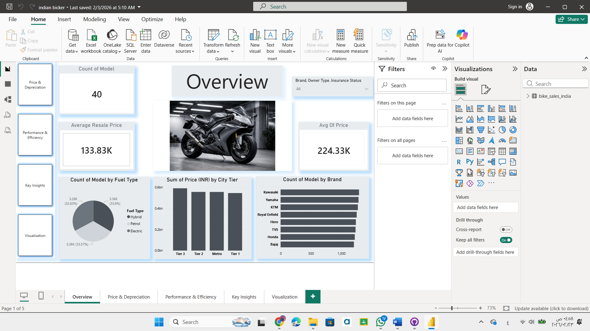
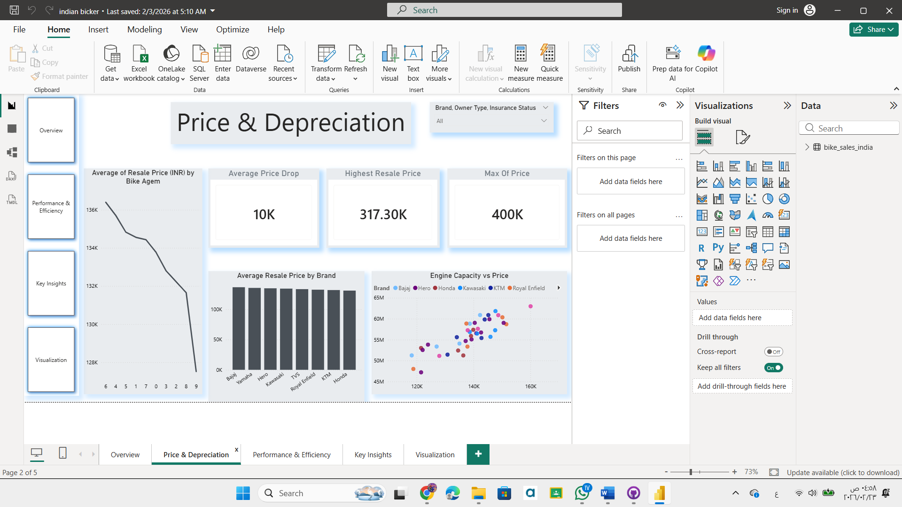
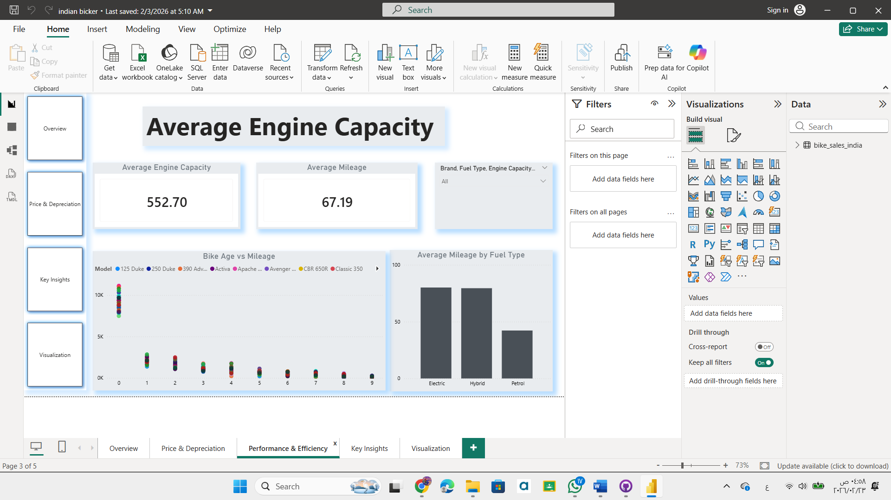
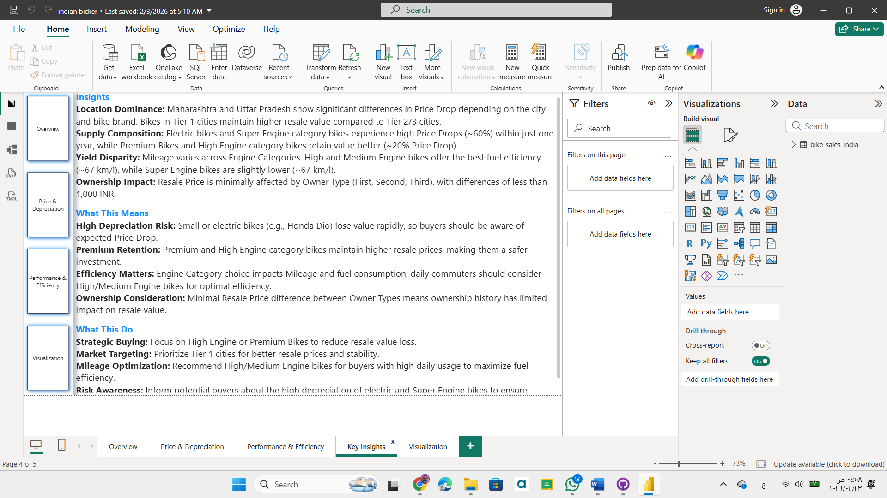

## 📌 Project Overview
This project focuses on analyzing the Indian motorcycle resale market using interactive Power BI dashboards.

The objective was to transform raw data into business-focused insights that help understand pricing behavior, depreciation patterns, and performance efficiency across different bike categories.

Rather than simple visualization, the dashboards were designed to support strategic decision-making for buyers, sellers, and market analysts.

---

## 🎯 Objectives
- Analyze resale price trends and depreciation behavior
- Identify high-value engine categories
- Compare fuel efficiency across engine segments
- Understand ownership impact on pricing
- Deliver actionable market insights

---

## 📊 Dashboard Highlights

### 1️⃣ Overview Dashboard
- Total Models Count
- Average Resale Price
- Fuel Type Distribution
- City Tier Market Overview
- Brand Comparison

### 2️⃣ Price & Depreciation Analysis
- Price Drop Trends
- Highest Resale Value Models
- Engine Capacity vs Price
- Brand Pricing Comparison

### 3️⃣ Performance & Efficiency
- Average Engine Capacity
- Mileage Analysis by Fuel Type
- Bike Age vs Mileage Relationship
- Efficiency Insights by Category

### 4️⃣ Key Insights Page
- Location Dominance Analysis
- Supply Composition Insights
- Depreciation Risk Analysis
- Strategic Buying Recommendations

---

## 🧠 Key Business Insights
- Premium and high-engine bikes retain higher resale value.
- Electric and small-engine bikes experience faster depreciation.
- Tier 1 cities maintain stronger resale stability.
- Engine category significantly influences mileage efficiency.
- Ownership history has limited impact on resale pricing.

---

## 💡 Strategic Recommendations
- Focus on high-engine categories for long-term value.
- Prioritize Tier 1 markets for resale investment.
- Optimize pricing strategies based on engine segment.
- Target daily commuters with medium/high engine efficiency bikes.

---

## 🛠 Tools Used
- Power BI
- Data Modeling
- KPI Analysis
- Business Intelligence Visualization

---

## 📊 Dashboard Preview

